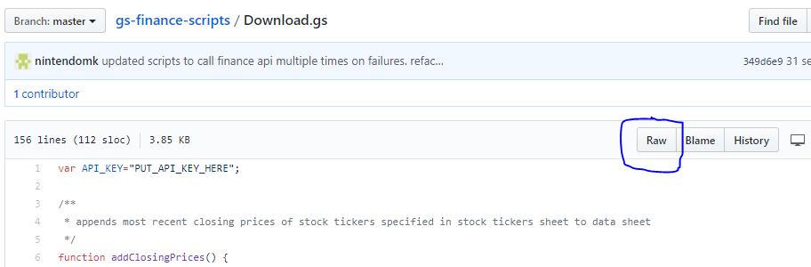

This repo contains the most up-to-date scripts needed for your google finance sheets. Make sure the contents of your scripts always match those of the scripts in this repo.

## Here's an easy way to copy the contents of a script:

1. Click on the script that you want to copy over to google sheets script editor (i.e.: Download.gs)

2. Click on the 'Raw' button on the top right, as illustrated in the picture below

3. Press 'ctrl + a' to select all lines.

4. Press 'ctrl + c' to copy to clipboard, or you can 'right click -> copy'.